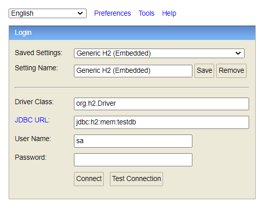

## How to run the application in H2 DB mode

- Go to the application.yml file and configure the JDBC H2 DB. In my case
```bash
  jdbc:h2:mem:testdb
```
- Start/Run your application
- Go to your browser and enter the url
```bash
  http://localhost:YOUR_SERVER_PORT/h2-console
```
- You will see the picture follow:


- Click to **Connect** to enter in your H2 DB application
